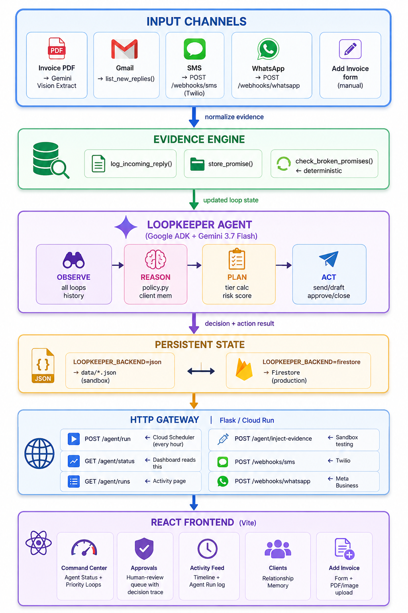

# LoopKeeper — Autonomous Collections Intelligence

> An AI agent that observes invoices, tracks client communication across Gmail/SMS/WhatsApp, reasons over relationship history, makes autonomous follow-up decisions, and replans when new evidence arrives — all while the browser is closed.

[](https://google.github.io/adk-docs/)
[](https://ai.google.dev/)
[](https://cloud.google.com/run)
[](https://firebase.google.com/docs/firestore)

---

## What LoopKeeper Does

Most invoices don't get chased — not because the freelancer forgot, but because chasing feels awkward and time-consuming. LoopKeeper removes the cognitive load:

1. **You add an invoice** (or upload a PDF — Gemini extracts the data)
2. **The agent observes** the invoice, client history, and incoming Gmail replies
3. **The agent reasons** using client relationship memory + policy rules
4. **The agent decides**: wait, send reminder, draft for approval, escalate, or verify
5. **New evidence arrives** (client promise, payment proof, dispute) — the agent **replans**
6. **Invoice resolves** — agent verifies and closes the loop
7. **You open the dashboard** — the agent has already acted while you were away

---

## Architecture



---

## Tech Stack

| Layer | Technology |
|---|---|
| AI Agent | [Google ADK](https://google.github.io/adk-docs/) 2.7.1 |
| Language Model | Gemini 3.7 Flash (`gemini-3.7-flash` via `GOOGLE_API_KEY`) |
| Invoice Extraction | Gemini Vision API (PDF + image) |
| Backend | Python 3.13 + Flask |
| Production Persistence | Google Firestore |
| Sandbox Persistence | Local JSON (`data/`) |
| Deployment | Google Cloud Run |
| Scheduler | Google Cloud Scheduler → `POST /agent/run` |
| Email | Gmail API (OAuth 2.0) |
| SMS | Twilio webhook → `/webhooks/sms` |
| WhatsApp | Meta Business API → `/webhooks/whatsapp` |
| Frontend | React 18 + Vite |
| Auth | Firebase Authentication (Google + Email) |

---

## Agentic Decision Lifecycle

```
Invoice overdue
       ↓
Agent detects → Tier 1 / Tier 2 / Tier 3
       ↓
Client replies: "I'll pay Friday"
       ↓
PLAN CHANGED: FOLLOW UP → WAIT UNTIL FRIDAY
       ↓
Friday passes, no payment
       ↓
PROMISE BROKEN → risk ↑ → re-escalate
       ↓
Client sends payment proof
       ↓
Agent refuses to close without verification
       ↓
Evidence confirmed → RESOLVED ✓
       ↓
User returns to dashboard
"Agent acted while you were away."
```

---

---

## How to Start Frontend & Backend (Step-by-Step)

### Prerequisites
- **Python 3.10+** (3.13 recommended)
- **Node.js 18+**
- (Optional) **Google Cloud Project** with Firestore & Cloud Run enabled for cloud production mode

---

### Option 1: Quickstart UI Demo Mode (Frontend Only)
Run the React dashboard immediately in Sandbox mode with built-in mock invoice data (no backend needed):

```bash
# 1. Navigate to frontend directory
cd frontend

# 2. Install dependencies
npm install

# 3. Start Vite dev server
npm run dev
```
Open **`http://localhost:5173`** in your browser. Click **"Try Demo — No account needed"** to explore.

---

### Option 2: Full Local Stack (Frontend + Python Backend Agent Runner)

#### Step 1: Start the Backend Server (Terminal 1)
```bash
# 1. From root directory, install Python dependencies
pip install -r requirements.txt

# 2. Set environment variables & start Flask runner (Port 8080)
# PowerShell (Windows):
$env:LOOPKEEPER_BACKEND="json"
$env:GOOGLE_API_KEY="your_gemini_api_key"   # Required for ADK agent reasoning & PDF vision
python runner.py

# Bash (Linux/macOS):
# LOOPKEEPER_BACKEND=json GOOGLE_API_KEY=your_key python runner.py
```
*Backend runner starts on `http://localhost:8080`.*

#### Step 2: Start the Frontend App (Terminal 2)
```bash
# Open a second terminal window
cd frontend
npm install
npm run dev
```
*Frontend starts on `http://localhost:5173`.*

#### Step 3: Trigger an Agent Cycle (Terminal 3 or UI)
You can trigger an agent cycle directly from the UI (**Settings → Trigger Agent Run & Check Inbox**) or via terminal:

```bash
curl -X POST http://localhost:8080/agent/run \
  -H "Content-Type: application/json" \
  -d '{"trigger": "manual"}'
```

#### Step 4: Inject Simulated Client Evidence (Sandbox Testing)
```bash
# Simulate client making a payment promise
curl -X POST http://localhost:8080/agent/inject-evidence \
  -H "Content-Type: application/json" \
  -d '{"loop_id":"inv_1002","type":"promise","promised_date":"2026-08-30","text":"Will pay Friday"}'

# Simulate client sending payment proof
curl -X POST http://localhost:8080/agent/inject-evidence \
  -H "Content-Type: application/json" \
  -d '{"loop_id":"inv_1002","type":"payment","text":"Wire transfer sent, ref TX-9821"}'
```

---

## Cloud Deployment

### Deploy to Cloud Run

```bash
gcloud run deploy loopkeeper \
  --source . \
  --region us-central1 \
  --allow-unauthenticated \
  --set-env-vars "LOOPKEEPER_BACKEND=firestore,GOOGLE_API_KEY=YOUR_KEY"
```

### Set up Cloud Scheduler

```bash
gcloud scheduler jobs create http loopkeeper-hourly \
  --location us-central1 \
  --schedule "0 * * * *" \
  --uri "https://YOUR_CLOUD_RUN_URL/agent/run" \
  --http-method POST \
  --message-body '{"trigger":"scheduler"}'
```

### Enable Gmail (optional — required for real email monitoring)

1. Enable Gmail API in Google Cloud Console
2. Create OAuth 2.0 Desktop credentials → download as `credentials.json` next to `runner.py`
3. First run opens a browser for one-time OAuth consent
4. Set `LOOPKEEPER_EMAIL_MODE=gmail` in your environment

### Enable SMS via Twilio (optional)

1. Get a Twilio number
2. Set webhook URL to `https://YOUR_URL/webhooks/sms`
3. Add client phone numbers to their profiles

### Enable WhatsApp via Meta (optional)

1. Set up Meta WhatsApp Business app
2. Set webhook URL to `https://YOUR_URL/webhooks/whatsapp`
3. Set `WHATSAPP_VERIFY_TOKEN=loopkeeper` (or your own token)

---

## Environment Variables

```env
# Backend mode
LOOPKEEPER_BACKEND=json        # or firestore

# Gemini AI
GOOGLE_API_KEY=your_key

# Email mode
LOOPKEEPER_EMAIL_MODE=gmail    # or leave unset for sandbox

# Firebase (frontend)
VITE_FIREBASE_API_KEY=
VITE_FIREBASE_AUTH_DOMAIN=
VITE_FIREBASE_PROJECT_ID=
VITE_FIREBASE_STORAGE_BUCKET=
VITE_FIREBASE_MESSAGING_SENDER_ID=
VITE_FIREBASE_APP_ID=

# Backend URL (for frontend to call)
VITE_CLOUD_RUN_URL=            # https://your-cloud-run-url.run.app

# WhatsApp verify token
WHATSAPP_VERIFY_TOKEN=loopkeeper
```

---

## Hackathon Submission — All Things Agentic

- ✅ **Autonomous agent**: Runs on Cloud Scheduler without user interaction
- ✅ **Google ADK 2.7.1**: `InMemoryRunner` + tool-calling agent loop
- ✅ **Gemini 2.5 Flash**: Reasoning + Gemini Vision for invoice extraction
- ✅ **Google Cloud Run**: Stateless HTTP gateway, scales to zero
- ✅ **Firestore**: Persistent agent memory across restarts
- ✅ **Multi-step workflows**: Observe → Reason → Decide → Act → Observe again
- ✅ **Meaningful actions**: Real email sends, approval queues, evidence verification
- ✅ **Multi-channel ingestion**: Gmail, SMS (Twilio), WhatsApp (Meta)
- ✅ **Replanning**: Agent changes strategy when new evidence arrives

---

## Project Structure

```
loop_keeper/
├── agent.py              # ADK agent definition + all tools
├── agent_runner.py       # run_agent_cycle() — core execution
├── runner.py             # Flask HTTP gateway + webhooks
├── gmail_client.py       # Gmail API send + read
├── policy.py             # Deterministic decision policy
├── store.py              # JSON backend (sandbox)
├── store_firestore.py    # Firestore backend (production)
├── data/
│   ├── clients.json      # Client profiles (phone, currency, address)
│   └── open_loops.json   # Invoice state
└── frontend/
    └── src/
        ├── pages/        # Dashboard, Approvals, Activity, Clients
        ├── components/   # LoopRow, MetricCard, EvidenceInjector
        └── auth/         # Firebase auth + protected routes
```